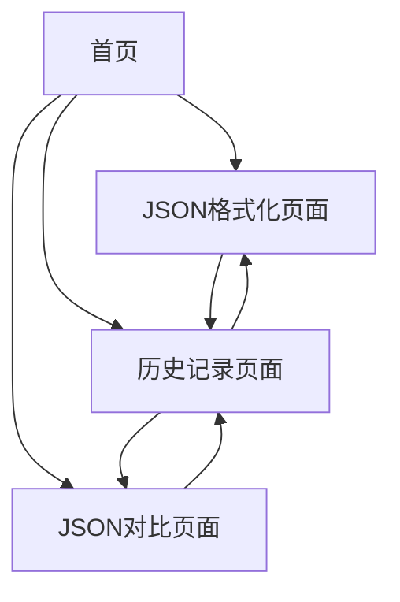

# JSON工具网站产品需求文档

## 1. Product Overview
面向开发者的专业JSON处理工具网站，提供JSON格式化、对比分析和历史记录管理功能。
- 解决开发者在API调试、数据分析、接口文档编写过程中的JSON处理需求，提升开发效率和数据可读性。
- 目标打造成开发者首选的轻量级、安全可靠的JSON在线工具平台。

## 2. Core Features

### 2.1 User Roles
本产品无需用户注册登录，所有功能对访客开放使用。

### 2.2 Feature Module
我们的JSON工具网站包含以下主要页面：
1. **首页**：导航菜单、功能入口、工具介绍
2. **JSON格式化页面**：JSON编辑器、格式化工具、语法校验、主题切换
3. **JSON对比页面**：双编辑器、差异分析、视图切换、导出功能
4. **历史记录页面**：记录列表、操作管理、数据恢复

### 2.3 Page Details

| Page Name | Module Name | Feature description |
|-----------|-------------|---------------------|
| 首页 | 导航菜单 | 提供工具分类导航，快速访问各功能模块 |
| 首页 | 功能介绍 | 展示工具特性和使用说明，帮助用户快速上手 |
| JSON格式化页面 | JSON编辑器 | 支持粘贴和文件上传JSON数据，提供语法高亮和自动补全 |
| JSON格式化页面 | 格式化工具 | 自动美化JSON格式，支持可配置缩进（2/4空格或Tab） |
| JSON格式化页面 | 语法校验 | 实时检测JSON语法错误，精准定位错误位置和原因 |
| JSON格式化页面 | 结构查看器 | 支持节点折叠展开，树形结构展示嵌套关系 |
| JSON格式化页面 | 性能优化 | 大文件分片渲染，虚拟滚动确保流畅体验 |
| JSON格式化页面 | 主题切换 | 提供明暗主题切换，适应不同使用环境 |
| JSON对比页面 | 双编辑器 | 左右两个JSON编辑器，支持独立编辑和粘贴 |
| JSON对比页面 | 差异分析 | 智能对比JSON结构和内容，高亮显示字段名、值、类型变化 |
| JSON对比页面 | 视图模式 | 支持左右并排和上下对照两种对比视图 |
| JSON对比页面 | 配置选项 | 可忽略字段顺序、空值差异等配置项 |
| JSON对比页面 | 导出功能 | 支持对比结果导出为纯文本或图片格式 |
| 历史记录页面 | 记录列表 | 显示最近使用的JSON数据，按时间倒序排列 |
| 历史记录页面 | 记录管理 | 支持查看、重载、重命名、删除单条记录 |
| 历史记录页面 | 批量操作 | 支持清空全部历史记录，确认后执行 |
| 历史记录页面 | 存储策略 | 基于LocalStorage本地存储，LRU策略维护最近20条记录 |

## 3. Core Process

**主要用户操作流程：**

1. **JSON格式化流程**：用户访问首页 → 点击JSON格式化 → 粘贴或上传JSON数据 → 自动格式化和语法校验 → 查看结构化结果 → 自动保存到历史记录

2. **JSON对比流程**：用户访问首页 → 点击JSON对比 → 在左右编辑器输入两段JSON → 点击对比分析 → 查看差异高亮结果 → 可选择导出对比结果 → 自动保存到历史记录

3. **历史记录管理流程**：用户访问历史记录页面 → 浏览历史操作记录 → 选择记录重新加载到对应工具 → 可选择删除或重命名记录

## 4. User Interface Design

### 4.1 Design Style
- **主色调**：深蓝色(#1e40af)作为主色，浅灰色(#f8fafc)作为背景色
- **辅助色**：绿色(#10b981)表示成功，红色(#ef4444)表示错误，橙色(#f59e0b)表示警告
- **按钮样式**：圆角按钮设计，hover状态有阴影效果
- **字体**：主要使用系统字体栈，代码区域使用等宽字体(Monaco, Consolas)
- **布局风格**：卡片式布局，顶部导航栏，响应式网格系统
- **图标风格**：使用简洁的线性图标，支持主题色彩适配

### 4.2 Page Design Overview

| Page Name | Module Name | UI Elements |
|-----------|-------------|-------------|
| 首页 | 导航菜单 | 顶部固定导航栏，深色背景，白色文字，hover效果 |
| 首页 | 功能介绍 | 三栏卡片布局，每个功能模块一张卡片，图标+标题+描述 |
| JSON格式化页面 | JSON编辑器 | Monaco Editor集成，语法高亮，行号显示，深色/浅色主题 |
| JSON格式化页面 | 工具栏 | 顶部工具栏包含格式化按钮、主题切换、文件上传等操作 |
| JSON格式化页面 | 结果展示 | 右侧面板展示格式化结果，支持树形结构和原始文本切换 |
| JSON对比页面 | 双编辑器 | 左右分栏布局，各占50%宽度，中间有分割线 |
| JSON对比页面 | 对比结果 | 下方展示区域，差异内容用不同颜色高亮显示 |
| 历史记录页面 | 记录列表 | 表格形式展示，包含时间、类型、操作等列，支持排序 |

### 4.3 Responsiveness
网站采用移动优先的响应式设计，桌面端为主要使用场景，移动端进行适配优化。支持触摸操作，确保在平板和手机上的可用性。断点设置：768px(平板)、1024px(桌面)。