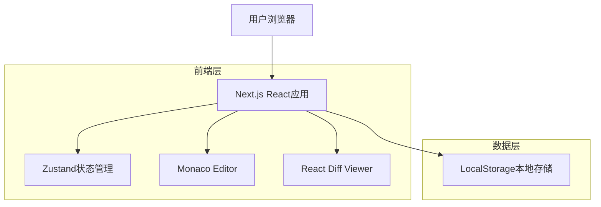
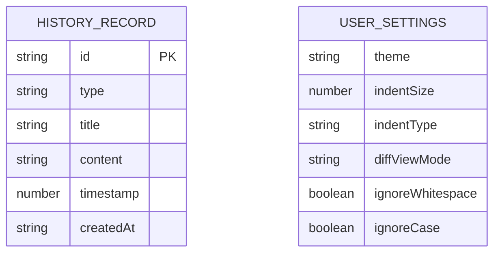

# JSON工具网站技术架构文档

## 1. Architecture design



## 2. Technology Description

* Frontend: Next.js\@14 + React\@18 + TypeScript\@5 + Tailwind CSS\@3 + Zustand\@4

* Backend: None (纯前端应用)

* 编辑器: Monaco Editor\@0.44 (VS Code同款编辑器)

* 对比组件: React Diff Viewer\@3

* 存储: LocalStorage (浏览器本地存储)

* 构建工具: Vite (Next.js内置)

* 部署: Vercel (推荐)

## 3. Route definitions

| Route      | Purpose                   |
| ---------- | ------------------------- |
| /          | 首页，展示工具介绍和功能导航            |
| /formatter | JSON格式化页面，提供JSON美化和语法校验功能 |
| /diff      | JSON对比页面，提供双JSON差异分析功能    |
| /history   | 历史记录页面，管理用户的操作历史          |

## 4. API definitions

本项目为纯前端应用，无后端API。所有数据处理均在浏览器端完成。

### 4.1 LocalStorage数据结构

**历史记录数据结构**

```typescript
interface HistoryRecord {
  id: string;
  type: 'format' | 'diff';
  title: string;
  content: string | { left: string; right: string };
  timestamp: number;
  createdAt: string;
}

interface HistoryState {
  records: HistoryRecord[];
  maxRecords: number; // 默认20条
}
```

**用户设置数据结构**

```typescript
interface UserSettings {
  theme: 'light' | 'dark' | 'system';
  indentSize: 2 | 4;
  indentType: 'spaces' | 'tabs';
  diffViewMode: 'split' | 'unified';
  ignoreWhitespace: boolean;
  ignoreCase: boolean;
}
```

## 5. Data model

### 5.1 Data model definition



### 5.2 Data Definition Language

**LocalStorage键值定义**

```typescript
// 历史记录存储键
const HISTORY_STORAGE_KEY = 'json-tools-history';

// 用户设置存储键
const SETTINGS_STORAGE_KEY = 'json-tools-settings';

// 默认设置
const DEFAULT_SETTINGS: UserSettings = {
  theme: 'system',
  indentSize: 2,
  indentType: 'spaces',
  diffViewMode: 'split',
  ignoreWhitespace: false,
  ignoreCase: false
};

// 历史记录管理类
class HistoryManager {
  private maxRecords = 20;
  
  // 添加记录（LRU策略）
  addRecord(record: Omit<HistoryRecord, 'id' | 'timestamp' | 'createdAt'>): void {
    const newRecord: HistoryRecord = {
      ...record,
      id: generateId(),
      timestamp: Date.now(),
      createdAt: new Date().toISOString()
    };
    
    const records = this.getRecords();
    records.unshift(newRecord);
    
    // 保持最大记录数限制
    if (records.length > this.maxRecords) {
      records.splice(this.maxRecords);
    }
    
    localStorage.setItem(HISTORY_STORAGE_KEY, JSON.stringify(records));
  }
  
  // 获取所有记录
  getRecords(): HistoryRecord[] {
    const data = localStorage.getItem(HISTORY_STORAGE_KEY);
    return data ? JSON.parse(data) : [];
  }
  
  // 删除记录
  deleteRecord(id: string): void {
    const records = this.getRecords().filter(r => r.id !== id);
    localStorage.setItem(HISTORY_STORAGE_KEY, JSON.stringify(records));
  }
  
  // 清空所有记录
  clearAll(): void {
    localStorage.removeItem(HISTORY_STORAGE_KEY);
  }
}
```

## 6. 核心功能实现方案

### 6.1 JSON格式化实现

```typescript
// JSON格式化核心逻辑
class JSONFormatter {
  static format(jsonString: string, options: FormatOptions): FormatResult {
    try {
      const parsed = JSON.parse(jsonString);
      const formatted = JSON.stringify(parsed, null, options.indentSize);
      return {
        success: true,
        formatted,
        error: null
      };
    } catch (error) {
      return {
        success: false,
        formatted: null,
        error: this.parseError(error, jsonString)
      };
    }
  }
  
  static parseError(error: any, jsonString: string): JSONError {
    // 解析错误位置和原因
    const match = error.message.match(/position (\d+)/);
    const position = match ? parseInt(match[1]) : 0;
    
    return {
      message: error.message,
      position,
      line: this.getLineNumber(jsonString, position),
      column: this.getColumnNumber(jsonString, position)
    };
  }
}
```

### 6.2 JSON对比实现

```typescript
// JSON对比核心逻辑
class JSONDiffer {
  static compare(left: string, right: string, options: DiffOptions): DiffResult {
    try {
      const leftObj = JSON.parse(left);
      const rightObj = JSON.parse(right);
      
      const differences = this.deepCompare(leftObj, rightObj, '', options);
      
      return {
        success: true,
        differences,
        leftValid: true,
        rightValid: true
      };
    } catch (error) {
      return {
        success: false,
        differences: [],
        leftValid: this.isValidJSON(left),
        rightValid: this.isValidJSON(right),
        error: error.message
      };
    }
  }
  
  private static deepCompare(left: any, right: any, path: string, options: DiffOptions): Difference[] {
    const differences: Difference[] = [];
    
    // 实现深度对比逻辑
    // 处理类型差异、值差异、结构差异等
    
    return differences;
  }
}
```

### 6.3 性能优化策略

1. **大文件处理**：使用Web Workers进行JSON解析，避免阻塞主线程
2. **虚拟滚动**：Monaco Editor内置虚拟滚动，处理大文件时保持流畅
3. **懒加载**：按需加载Monaco Editor和Diff Viewer组件
4. **缓存策略**：对格式化结果进行内存缓存，避免重复计算
5. **防抖处理**：输入时使用防抖，减少不必要的实时校验

### 6.4 安全性考虑

1. **本地处理**：所有JSON数据仅在浏览器端处理，不上传服务器
2. **XSS防护**：对用户输入进行适当转义，防止恶意脚本注入
3. **存储限制**：LocalStorage有容量限制，实现存储配额管理
4. **错误处理**：完善的错误边界，防止应用崩溃

